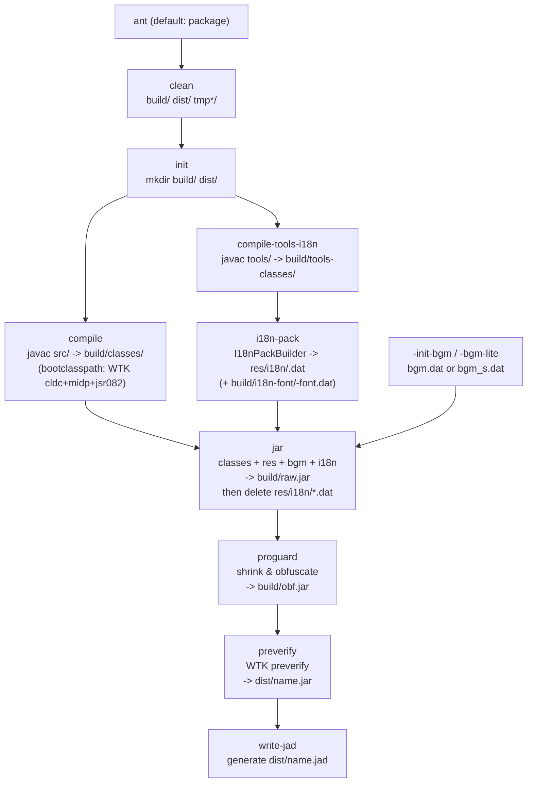
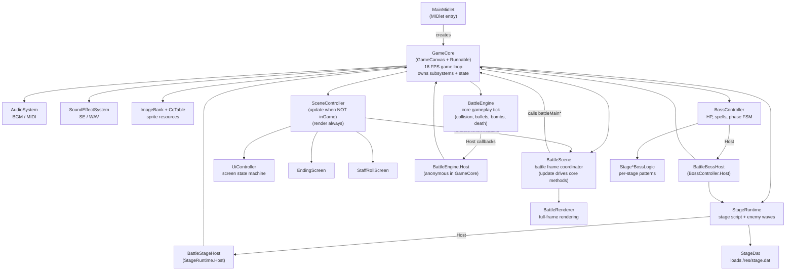
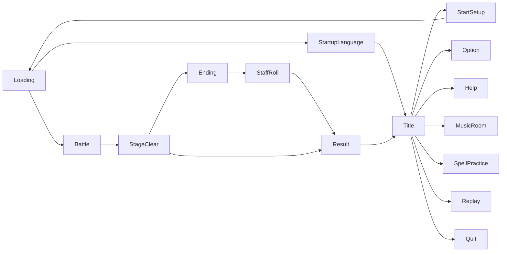

# Project Tree

## Directory Structure

```
Touhou Misfortune MirrorS Tale/
├── build.xml                        # Ant build script (compile, pack, obfuscate, preverify, JAD)
├── .gitignore                       # Git ignore rules (build output, emulator runtime, etc.)
├── README.md                        # Project overview
├── TODO.MD                          # Development task tracker
│
├── src/touhou/                      # ---- Java source (MIDP 2.0 / CLDC 1.1) ----
│   ├── MainMidlet.java              #   MIDlet entry point
│   ├── GameCore.java                #   Main game loop, core orchestrator (GameCanvas + Runnable)
│   ├── SceneController.java         #   Scene routing: UI / Battle / Ending / StaffRoll
│   ├── ImageBank.java               #   Sprite image loader, cache, StageEX color variant generator
│   ├── CcTable.java                 #   cc.dat parser: maps spriteId to (imgIndex, srcRect, anchor)
│   ├── BulletSprites.java           #   Draws sprites by spriteId using CcTable + ImageBank
│   ├── BulletSystem.java            #   Player bullet / laser / effect pool
│   ├── EnemyBulletSystem.java       #   Enemy bullet pool
│   ├── EnemySystem.java             #   Enemy instance pool
│   ├── DropItemSystem.java          #   Drop item pool (power, point, bomb, life, etc.)
│   ├── Player.java                  #   Player character: movement, shooting, bomb, death/respawn
│   ├── ScoreSystem.java             #   Score events, graze, life/bomb awards, spell bonus
│   ├── AudioSystem.java             #   BGM playback (MIDI from bgm.dat)
│   ├── SoundEffectSystem.java       #   SE playback (WAV)
│   ├── GameOptions.java             #   User settings persistence (RMS)
│   ├── GameProgress.java            #   Save data: unlocks, high scores (RMS)
│   ├── UnlockFlags.java             #   Stage / Extra / Spell Practice unlock state
│   ├── MusicRoomSettings.java       #   Music room unlock tracking
│   ├── ResultStats.java             #   Singleton: playtime, boot time, spell stats -> GameProgress
│   ├── SpStore.java                 #   Scratch-pad storage (RMS)
│   ├── VibrationController.java     #   Vibration motor control
│   ├── Fixed.java                   #   Fixed-point 16.16 utilities
│   ├── Trig.java                    #   Fixed-point sin/cos lookup table
│   ├── Debug.java                   #   Debug overlay & profiling
│   │
│   ├── battle/                      #   -- Battle subsystem --
│   │   ├── BattleScene.java         #     Battle-state coordinator: handles stage clear panel, pause flow, spell practice end flow; delegates gameplay ticks to `GameCore` (battleMain* methods) and delegates rendering to `BattleRenderer`
│   │   ├── BattleEngine.java        #     Core gameplay tick: collision, bullets, bombs, death
│   │   ├── BattleRenderer.java      #     Full battle-frame rendering pipeline
│   │   ├── BattleStageFlow.java     #     Adapter: implements StageRuntime.StageFlow -> GameCore
│   │   ├── BattleStageHost.java     #     Adapter: implements StageRuntime.Host -> GameCore
│   │   ├── BattleBossHost.java      #     Adapter: implements BossController.Host -> GameCore
│   │   ├── BattleContinueSystem.java#     Continue count management & consumption
│   │   ├── BattleHudData.java       #     HUD data access interface
│   │   ├── BattleHudModel.java      #     HUD data model (implements BattleHudData)
│   │   └── BattleMath.java          #     Fixed-point speed/angle calculations (speedCos, speedSin, normalizeDeg)
│   │
│   ├── stage/                       #   -- Stage script & boss --
│   │   ├── StageRuntime.java        #     Stage tick driver: script, waves, transitions
│   │   ├── StagePreloader.java      #     Pre-stage resource loading (final step calls System.gc())
│   │   ├── StageDat.java            #     stage.dat parser (wave script)
│   │   ├── StageDochu.java          #     Mid-stage (dochu) enemy shooting patterns
│   │   ├── BossController.java      #     Boss FSM: HP, spell timer, phases; hosts BossStageLogic[7]
│   │   ├── BossStageLogic.java      #     Boss logic interface (tickBoss / tickMidboss)
│   │   ├── AbstractBossStageLogic.java#   Abstract base: state sync with BossController, shared fields
│   │   ├── Stage1BossLogic.java     #     Stage 1 boss patterns
│   │   ├── Stage2BossLogic.java     #     Stage 2 boss patterns
│   │   ├── Stage3BossLogic.java     #     Stage 3 boss patterns
│   │   ├── Stage4BossLogic.java     #     Stage 4 boss patterns
│   │   ├── Stage5BossLogic.java     #     Stage 5 boss patterns
│   │   ├── Stage6BossLogic.java     #     Stage 6 (final) boss patterns
│   │   └── StageExtraBossLogic.java #     EX stage boss patterns
│   │
│   ├── replay/                      #   -- Replay subsystem --
│   │   ├── ReplayHeader.java        #     Replay metadata (character, difficulty, score, etc.)
│   │   ├── ReplayInputBuffer.java   #     Fixed-size per-frame key buffer (pos 0..FRAME_COUNT)
│   │   ├── ReplayKeyCodec.java      #     Per-frame key bit-packing (keys/pressed -> byte)
│   │   ├── ReplayCodec.java         #     Fixed-size RLE codec for replay frames (30720 -> 7168)
│   │   ├── ReplayRecordingController.java # Recording session controller
│   │   ├── ReplayPlaybackController.java  # Playback session controller
│   │   ├── ReplayTimeScaleController.java # Replay playback speed (slow/fast/auto-FF)
│   │   ├── ReplayStageRecorder.java #     Per-stage recording helper
│   │   ├── ReplayRng.java           #     Deterministic LCG RNG for replay sync
│   │   ├── ReplayRmsStore.java      #     Replay save/load via RMS
│   │   ├── ReplaySaveService.java   #     Save workflow orchestration
│   │   ├── ReplayShareCodec.java    #     Bluetooth share protocol codec
│   │   ├── ReplayShareService.java  #     Bluetooth share session manager
│   │   ├── ReplayBtShareManager.java#     Bluetooth discovery & connection
│   │   ├── ReplaySnapshotReader.java#     Snapshot deserialization
│   │   ├── ReplaySnapshotWriter.java#     Snapshot serialization
│   │   ├── ReplayBossSnapshotCodec.java   # Boss phase snapshot codec
│   │   ├── ReplayBossSnapshotService.java # Boss snapshot orchestration
│   │   ├── ReplayBossSnapshotStore.java   # Boss snapshot persistence
│   │   ├── ReplayStageSnapshotCodec.java  # Stage snapshot codec
│   │   ├── ReplayStageSnapshotService.java# Stage snapshot orchestration
│   │   └── ReplayStageSnapshotStore.java  # Stage snapshot persistence
│   │
│   ├── i18n/                        #   -- Internationalization --
│   │   ├── I18n.java                #     Static utility: language ID/code, resource path builder
│   │   ├── I18nBootstrap.java       #     Init I18N from saved options (loads pack, text, font)
│   │   ├── I18nPack.java            #     Binary .dat resource pack reader
│   │   ├── TextId.java              #     All text ID constants
│   │   └── UiText.java              #     Static UI text table loaded from ui.txt, indexed by TextId
│   │
│   ├── font/                        #   -- Bitmap font --
│   │   └── BitmapFont.java          #     font.dat renderer (variable-width bitmap glyphs)
│   │
│   ├── bt/                          #   -- Bluetooth --
│   │   └── BtSppLink.java           #     JSR-82 SPP serial link for replay sharing
│   │
│   └── ui/                          #   -- UI screens --
│       ├── UiController.java        #     UI screen state machine & navigation
│       ├── UiDraw.java              #     Shared UI drawing primitives
│       ├── InputSystem.java         #     Per-frame key state capture, edge detection, softkey/tenkey
│       ├── StartupLanguageMenu.java #     First-launch language selection
│       ├── TitleScreen.java         #     Title menu
│       ├── StartSetupScreen.java    #     Game start: character & difficulty select
│       ├── LoadingScreen.java       #     Stage loading progress
│       ├── BattlePauseScreen.java   #     In-game pause overlay
│       ├── StageClearResultPanel.java#    Stage clear result & replay save prompt
│       ├── ResultScreen.java        #     Game over / all clear result
│       ├── EndingScreen.java        #     Per-character ending sequence
│       ├── StaffRollScreen.java     #     Credits roll
│       ├── StoryScreen.java         #     Story / dialog display
│       ├── OptionScreen.java        #     Settings menu
│       ├── HelpScreen.java          #     How-to-play guide
│       ├── MusicRoomScreen.java     #     Music room (BGM jukebox)
│       ├── SpellPracticeScreen.java #     Spell practice selection
│       ├── SpellPracticeEndScreen.java#   Spell practice result
│       ├── ReplayScreen.java        #     Replay list & playback
│       ├── ReplaySaveUi.java        #     Replay save dialog
│       ├── ReplaySendScreen.java    #     Bluetooth send UI
│       ├── ReplayReceiveScreen.java #     Bluetooth receive UI
│       └── QuitScreen.java          #     Quit confirmation
│
├── res/                             # ---- Game resources ----
│   ├── icon.png                     #   MIDlet icon
│   ├── cc.dat                       #   Sprite crop table (spriteId -> imgIndex + srcRect + anchor)
│   ├── stage.dat                    #   Stage wave script (enemy type, position, timing)
│   ├── sp/                          #   Sprite images (GIF): 000.gif ~ 095.gif (missing 078-080, 082-084: generated at runtime)
│   ├── se/                          #   Sound effects (WAV)
│   │   ├── shot.wav                 #     Player shot
│   │   ├── graze.wav                #     Graze
│   │   ├── crash.wav / crash2.wav   #     Player death / enemy death
│   │   ├── power.wav                #     Power item pickup
│   │   ├── life.wav                 #     1UP
│   │   ├── reimu.wav / marisa.wav / alice.wav  # Character voice
│   │   ├── nav.wav / select.wav / back.wav     # Menu navigation
│   │   ├── pause.wav                #     Pause
│   │   └── cd.wav                   #     Countdown
│   ├── snd/                         #   BGM packs (MIDI bundle)
│   │   ├── bgm.dat                  #     Full quality (18 tracks)
│   │   └── bgm_s.dat               #     Simplified 12-polyphony version
│   └── i18n/                        #   Localization source (per-language)
│       ├── en/ ja/ zht/             #     Each contains:
│       │   ├── ui.txt               #       UI text lines (indexed by TextId)
│       │   ├── story.txt            #       Story text
│       │   ├── ending_*.txt         #       Per-character ending text
│       │   ├── spcard.dat           #       Spell card names
│       │   ├── sprac.dat            #       Spell practice metadata
│       │   ├── dialog/              #       In-game dialog scripts
│       │   └── font/                #       (optional source dir; ignored by packer)
│       └── *.dat                    #     (build-time generated, cleaned after JAR packing)
│
├── font/                            # ---- TTF source fonts (for font.dat generation) ----
│   ├── ja.ttf                       #   Japanese glyphs
│   ├── zh_hant.ttf                  #   Traditional Chinese (used by en & zht)
│   ├── zh_hans.ttf                  #   Simplified Chinese (reserved)
│   ├── OFL.txt                      #   SIL Open Font License
│   └── LICENSE/                     #   Per-font license files
│       ├── ark-pixel.txt
│       ├── cubic-11.txt
│       └── galmuri.txt
│
├── lib/                             # ---- Build-time libraries ----
│   ├── antenna-bin-1.2.1-beta.jar   #   Antenna: WTK task wrappers (wtkpreverify, wtkjad)
│   └── proguard.jar                 #   ProGuard: bytecode shrink & obfuscation
│
├── tools/                           # ---- Build tools (used by ant) ----
│   ├── CcDatCropViewer.java         #   cc.dat crop viewer (debug / resource inspection)
│   ├── I18nPackBuilder.java         #   Packs res/i18n/<lang>/ into <lang>.dat; generates font.dat
│   ├── FontDatBuilder.java          #   Scans text files for used characters, rasterizes from TTF, outputs font.dat
│   └── dev/                         #   (gitignored) Dev-only tools: BGM builder, MIDI simplifier, etc.
│
├── docs/                            # ---- Documentation ----
│   ├── build.md                     #   Build instructions
│   ├── dev.md                       #   Development guide, directory overview, I18N, tools
│   └── tree.md                      #   This file
│
├── emulator/                        # (gitignored) FreeJ2ME runtime directory
├── build/                           # (gitignored) Ant build output
└── dist/                            # (gitignored) Final JAR + JAD
```

---

## Build Pipeline



---

## Runtime Architecture



### UI Screen Flow



---

## Module Responsibilities

### Core Layer

| File | Role |
|------|------|
| `MainMidlet` | MIDlet lifecycle; creates `GameCore`, hands it to `Display` |
| `GameCore` | Central orchestrator: game loop, state ownership, and module wiring. Contains legacy/bridge logic while gradually pushing responsibilities into modules |
| `SceneController` | Routes each frame's `update()` / `render()` to the active scene (UI, Battle, Ending, StaffRoll) |

### Battle Layer

| File | Role |
|------|------|
| `BattleScene` | Battle-state coordinator: handles stage clear panel, pause flow, spell practice end flow; delegates gameplay ticks to `GameCore` (battleMain* methods) and delegates rendering to `BattleRenderer` |
| `BattleEngine` | Pure gameplay tick: player input -> bullet advance -> collision -> death -> score. Stateless about scene flow |
| `BattleRenderer` | Full-frame battle rendering: playfield, HUD, effects, dialog, boss cut-in, fade |
| `BattleStageFlow` | Adapter: implements `StageRuntime.StageFlow`, bridges stage flow events to `GameCore` |
| `BattleStageHost` | Adapter: implements `StageRuntime.Host`, bridges stage runtime events to `GameCore` |
| `BattleBossHost` | Adapter: implements `BossController.Host`, bridges boss events to `GameCore` |
| `BattleContinueSystem` | Continue count management & consumption (3 credits for normal mode) |
| `BattleHudData` | HUD data access interface (getScore, getLevel, etc.) |
| `BattleHudModel` | Concrete HUD data model, implements `BattleHudData` |
| `BattleMath` | Fixed-point speed/angle calculations (speedCos, speedSin, normalizeDeg) |

### Stage Layer

| File | Role |
|------|------|
| `StageRuntime` | Drives one stage: reads `stage.dat`, spawns enemy waves, manages transitions |
| `StagePreloader` | Pre-stage resource loading (final step calls System.gc()) |
| `StageDat` | Parses `stage.dat` binary format into wave table |
| `StageDochu` | Mid-stage (dochu) enemy shooting patterns per enemyType |
| `BossController` | Boss FSM: HP, spell timer, phase transitions; hosts `BossStageLogic[7]` for all stages |
| `AbstractBossStageLogic` | Abstract base: implements `BossStageLogic`, syncs shared state (bwave, spellId, etc.) with `BossController` via pull/push |
| `Stage[1-6]BossLogic` | Per-stage boss spell card patterns (faithful port from DoJa) |
| `StageExtraBossLogic` | EX stage boss patterns (single difficulty, no level branching) |

### Replay Layer

| File | Role |
|------|------|
| `ReplayHeader` | Metadata: character, difficulty, stage, score, date |
| `ReplayInputBuffer` | Fixed-size per-frame key buffer (FRAME_COUNT = 30720) |
| `ReplayKeyCodec` | Per-frame key bit-packing (keys/pressed -> byte) |
| `ReplayCodec` | Fixed-size RLE codec for replay frames (30720 -> 7168) |
| `ReplayRecordingController` | Recording session: captures keys + snapshots during play |
| `ReplayPlaybackController` | Playback session: feeds recorded keys back into engine |
| `ReplayTimeScaleController` | Replay playback speed: slow/fast/auto fast-forward controller |
| `ReplayStageRecorder` | Per-stage recording lifecycle |
| `ReplayRng` | Seeded LCG RNG (state * 1103515245 + 12345) for deterministic replay |
| `ReplayRmsStore` | RMS persistence for replay slots |
| `ReplaySaveService` | Save workflow orchestration |
| `ReplayShareCodec` | Bluetooth share protocol codec |
| `ReplayShareService` | Bluetooth share session manager |
| `ReplayBtShareManager` | Bluetooth discovery & connection |
| `ReplaySnapshotReader` | Snapshot deserialization |
| `ReplaySnapshotWriter` | Snapshot serialization |
| `ReplayBossSnapshotCodec` | Boss phase snapshot codec |
| `ReplayBossSnapshotService` | Boss snapshot orchestration |
| `ReplayBossSnapshotStore` | Boss snapshot persistence |
| `ReplayStageSnapshotCodec` | Stage snapshot codec |
| `ReplayStageSnapshotService` | Stage snapshot orchestration |
| `ReplayStageSnapshotStore` | Stage snapshot persistence |

### I18N & Font

| File | Role |
|------|------|
| `I18n` | Static utility: language ID/code management, resource path builder, text resource reader |
| `I18nBootstrap` | Initializes I18N subsystem from saved `GameOptions` (loads pack, text, font) |
| `I18nPack` | Reads binary `.dat` resource packs |
| `TextId` | All text ID constants (UI lines, dialog, endings) |
| `UiText` | Static UI text table loaded from `ui.txt`, line-indexed by `TextId` |
| `BitmapFont` | Renders variable-width bitmap glyphs from `font.dat` |

### Resource & System

| File | Role |
|------|------|
| `ImageBank` | Loads GIF sprites from `/res/sp/`, caches, generates StageEX color variants |
| `CcTable` | Parses `cc.dat`: maps spriteId -> (imgIndex, srcX, srcY, w, h, anchorX, anchorY) |
| `BulletSprites` | Draws a sprite by spriteId (method param is often named bulletId) using `CcTable` + `ImageBank` |
| `BulletSystem` | Player bullet / laser / effect object pool (capacity 1024) |
| `EnemyBulletSystem` | Enemy bullet object pool |
| `EnemySystem` | Enemy instance pool |
| `DropItemSystem` | Drop item pool |
| `Player` | Player character: position, shot type, bomb, death, respawn, graze |
| `AudioSystem` | BGM: reads `bgm.dat` bundle, plays MIDI tracks via `Manager`/`Player` |
| `SoundEffectSystem` | SE: plays WAV files from `/res/se/` |
| `ScoreSystem` | Event-driven scoring: graze, spell bonus, life/bomb awards, miss penalty |
| `GameOptions` | User settings (key config, volume, difficulty) persisted to RMS |
| `GameProgress` | Save data: high scores, clears, unlocks |
| `UnlockFlags` | Tracks which stages / extras / spell practices are unlocked |
| `SpStore` | General-purpose scratch-pad RMS store |
| `VibrationController` | Device vibration motor |
| `Fixed` | Fixed-point 16.16 arithmetic |
| `Trig` | Pre-computed sin/cos table (fixed-point) |
| `Debug` | Debug overlay, frame profiler |

### UI Screens

| File | Role |
|------|------|
| `UiController` | Screen state machine: manages which screen is active, handles transitions |
| `UiDraw` | Shared drawing: text, boxes, list menus, bitmap font integration |
| `InputSystem` | Per-frame key state capture, edge detection, softkey/tenkey handling |
| `StartupLanguageMenu` | Startup language picker (shown after `LoadingScreen`, before entering `TitleScreen`) |
| `TitleScreen` | Main menu: Start / Continue / Practice / Replay / Option / Help / Quit |
| `StartSetupScreen` | Character select + difficulty select |
| `LoadingScreen` | Stage loading progress bar |
| `BattlePauseScreen` | Pause overlay during gameplay |
| `StageClearResultPanel` | Post-stage result + replay save prompt |
| `ResultScreen` | Game Over / All Clear result display |
| `EndingScreen` | Per-character ending narrative sequence |
| `StaffRollScreen` | Credits scroll |
| `StoryScreen` | In-game story / dialog renderer |
| `OptionScreen` | Settings: key config, volume, language switch |
| `HelpScreen` | How-to-play instruction pages |
| `MusicRoomScreen` | BGM jukebox (unlock-gated) |
| `SpellPracticeScreen` | Spell card practice selection |
| `SpellPracticeEndScreen` | Spell practice result |
| `ReplayScreen` | Saved replay list & playback launch |
| `ReplaySaveUi` | Replay save dialog after stage clear |
| `ReplaySendScreen` | Bluetooth send UI |
| `ReplayReceiveScreen` | Bluetooth receive UI |
| `QuitScreen` | Exit confirmation |

### Build Tools

| File | Role |
|------|------|
| `I18nPackBuilder` | Scans `res/i18n/<lang>/` and packs resources into `<lang>.dat`; generates font.dat |
| `FontDatBuilder` | Scans text files for used characters, rasterizes from TTF, outputs font.dat |

### Resource Files

| Path | Format | Role |
|------|--------|------|
| `res/cc.dat` | Binary | Sprite crop table: spriteId -> (imgIndex, srcX, srcY, w, h, anchorX, anchorY) |
| `res/stage.dat` | Binary | Stage wave script: enemy type, position, timing, formation |
| `res/sp/*.gif` | GIF | Sprite sheets indexed by imgIndex (000.gif ~ 095.gif; missing 078-080, 082-084 are runtime-generated StageEX variants) |
| `res/se/*.wav` | WAV | Sound effects |
| `res/snd/bgm.dat` | Custom | MIDI bundle: intro + loop segments for 18 BGM tracks |
| `res/snd/bgm_s.dat` | Custom | Same format, reduced polyphony (12 voices) for weaker devices |
| `res/i18n/<lang>.dat` | Binary | I18N resource pack built by `I18nPackBuilder` and embedded into the final JAR; contains text data + generated `/res/i18n/<lang>/font/font.dat` |
| `res/i18n/<lang>/ui.txt` | Text | UI string lines, indexed by `TextId` constants |
| `res/i18n/<lang>/dialog/` | Text | In-game dialog scripts per stage |
| `res/i18n/<lang>/spcard.dat` | Text | Spell card name list |
| `/res/i18n/<lang>/font/font.dat` | Binary | Bitmap font glyph atlas (generated at build time and stored inside `res/i18n/<lang>.dat`) |
